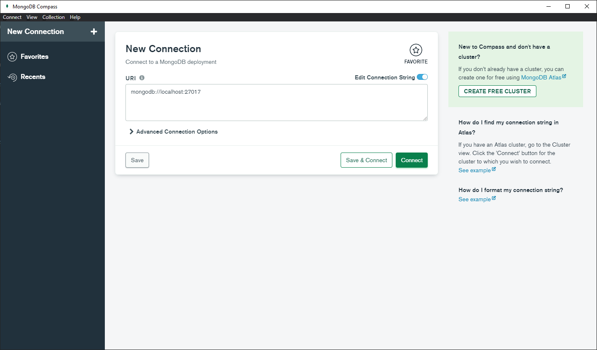
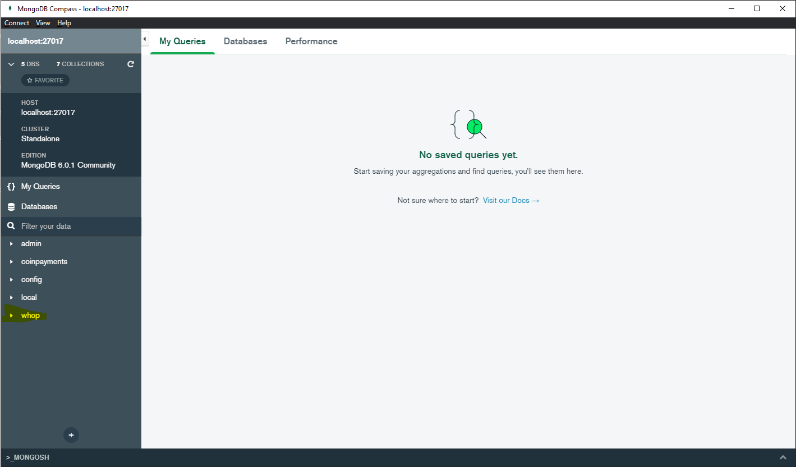
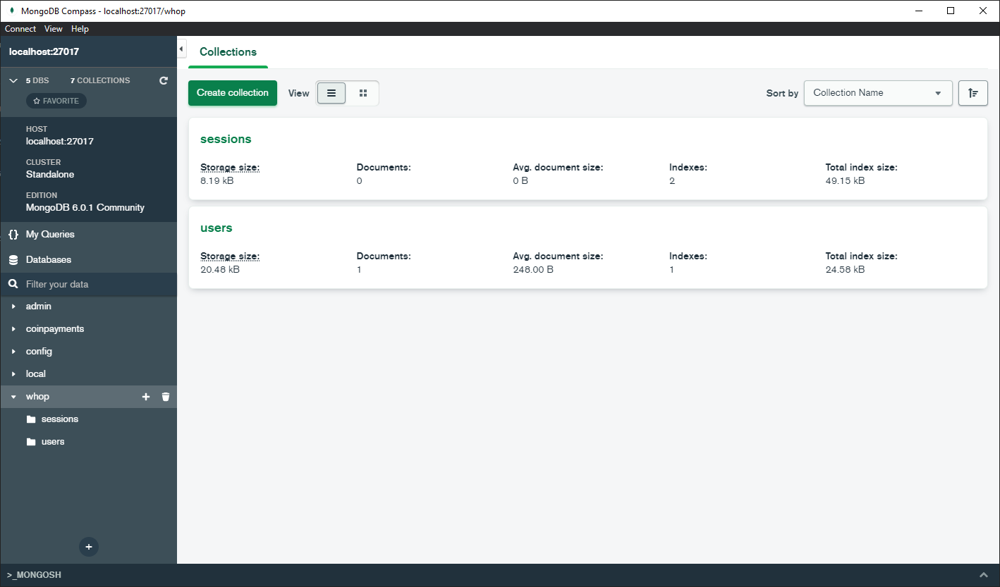
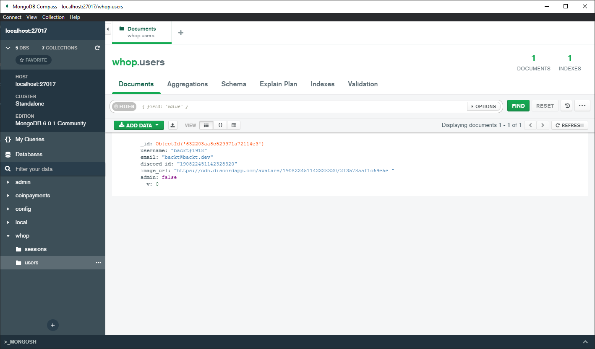
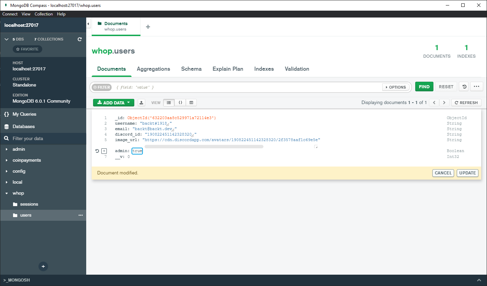
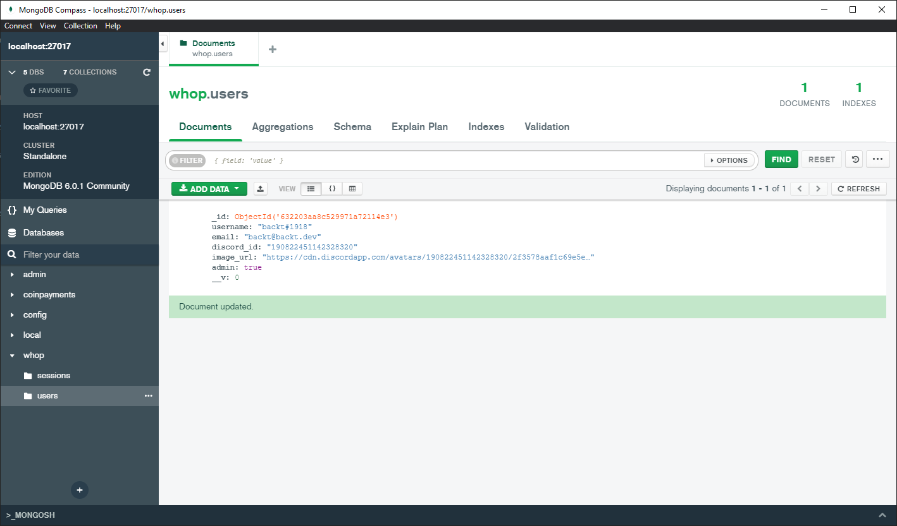

# Administrator rights

All is left to do is to give yourself administrator rights, so you can access the admin panel.

Let's open our MongoDB Compass and connect to our database.

In the ``URI`` field, paste your MongoDB connection string and click ``Connect``.

Now click on ``whop`` to access our database.

Now that we are connected to our database, let's go to our ``users`` collection.

Now that we are in our ``users`` collection, let's find our user.

Now that we have found our user, let's change the ``admin`` value to ``true``.

Now that we have changed the ``admin`` value to ``true``, let's save our changes.

Awesome! Now that we have given ourselves administrator rights, we can access the admin panel.