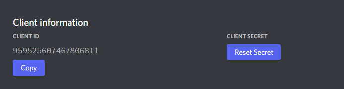

# Enviroment Setup

Congratulations! You have successfully understood how the Whop API works and how to do basic functions, let's start now with our Advanced Guide.

## Advanced Guide

In this Tutorial we will be using **[NodeJS](https://nodejs.org/en/)** as our primary language.

We will be using the following modules.

- **[dotenv](https://www.npmjs.com/package/dotenv)**
- **[express](https://www.npmjs.com/package/express)**
- **[express-session](https://www.npmjs.com/package/express-session)**
- **[mongoose](https://www.npmjs.com/package/mongoose)**
- **[connect-mongo](https://www.npmjs.com/package/connect-mongo)**
- **[passport](https://www.npmjs.com/package/passport)**
- **[passport-discord](https://www.npmjs.com/package/passport-discord)**
- **[ejs](https://www.npmjs.com/package/ejs)**
- **[path](https://www.npmjs.com/package/path)**
- **[node-fetch@2](https://www.npmjs.com/package/node-fetch)**

Create a folder and cd into it:

```bash
mkdir our-awesome-project
cd our-awesome-project
```

Or simply right click and create a new folder if you are using Windows/MacOS.

Now we will need to initialize our project by using the following command:

```bash
npm init -y
```

Then we will install our modules using this command:

```bash
npm install dotenv express express-session mongoose connect-mongo passport passport-discord ejs path node-fetch@2
```

Version 2 supports CommonJs ``require('node-fetch')`` method, higher versions only supports ES6 ``import fetch from 'node-fetch'``.

## MongoDB

We will be using MongoDB as our database, so we will need to create a MongoDB database.

Let's download MongoDB from [here](https://www.mongodb.com/try/download/community).


After you have downloaded MongoDB, let's install it and make sure to install MongoDB Compass as well.


## Discord Developer Portal

We will be using the Discord Developer Portal to create our Discord Application.

Let's create a new application by clicking [here](https://discord.com/developers/applications).

Click on the ``New Application`` button and give your application a name.


After you have created your application, let's copy your ``Client ID`` and ``Client Secret``.

Go to the ``OAuth2`` tab and click on the ``General`` button.



Now let's create our callback URL, we will be using ``http://localhost/auth/callback`` as our callback URL.


Make sure to save your changes.


## Conclusion

Awesome! now that you have initialized your project and installed the required modules let's head to the next tutorial.