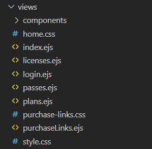
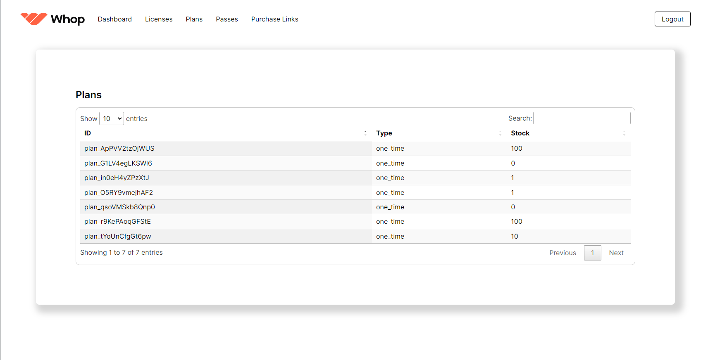

# Views Folder

Now all that is left to do is to create our ``views`` folder, this is where we will store all of our ``ejs`` files.

Download our premade files **[here](/frontend.zip)**.

You will need to extract the ``frontend.zip`` file and put it inside the ``views`` folder.

Now that you have extracted the ``frontend.zip`` file, let's explain what each file does.

## login.ejs

This is the login page, it will be used to login to the panel.

## index.ejs

This is the main page of the panel which will have all the licenses the user have.

## licenses.ejs

This is the license page which will show all the licenses.

## plans.ejs

This is the plans page which will show all the plans.

## passes.ejs

This is the passes page which will show all the passes.

## purchaseLink.ejs

This is the purchase link page which will be used to create purchase links.

